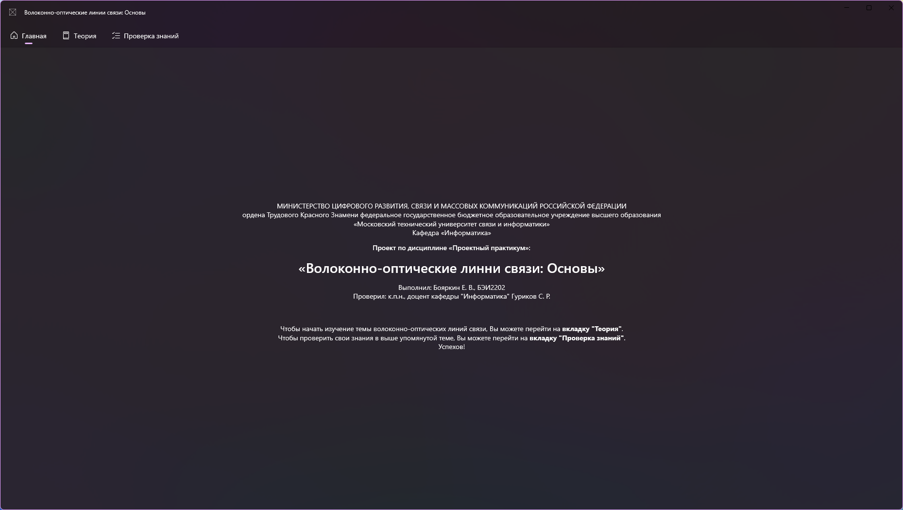
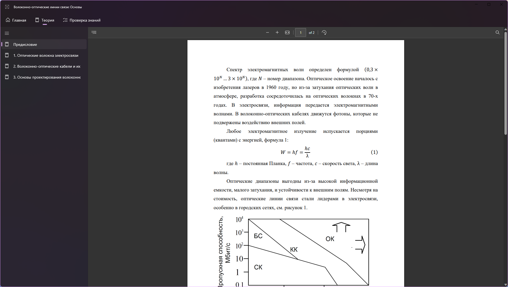
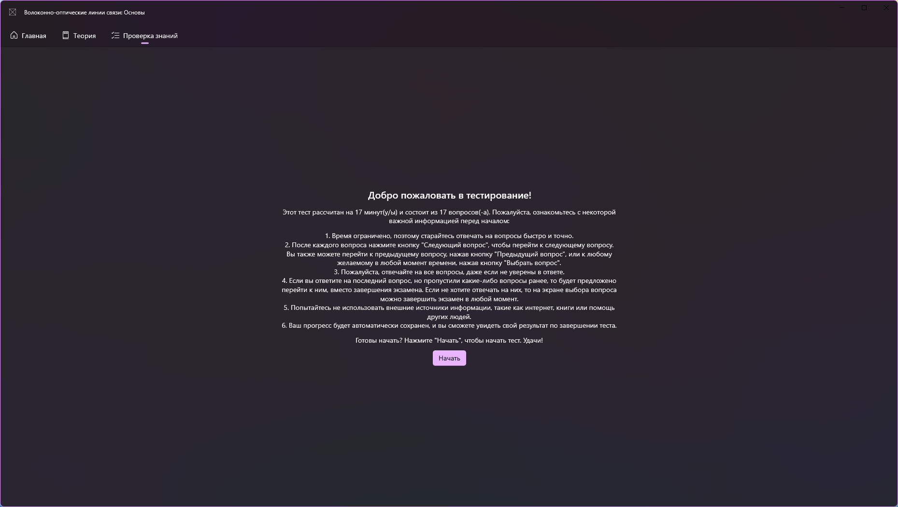
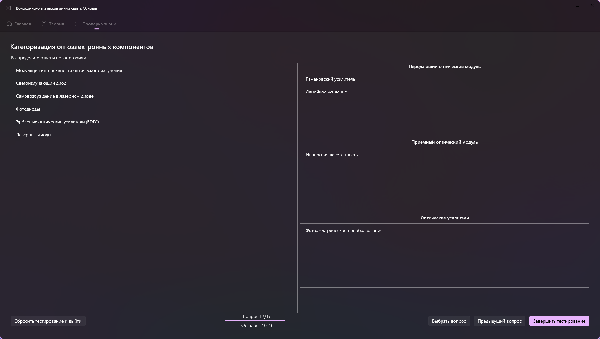

# FiberOpticCommsCourseware (3rd semester)

**FiberOpticCommsCourseware** is a project for learning about fiber-optic communication. It is also coursework for 3rd semester of the university course "Project practice".

## Overview

The application contains three main pages:

1. Welcome page
Contains basic information about development (per requirement of the university) and short usage guide.

2. Theory page
Used book: Engibaryan, I. A. Fiber-Optic Communication Lines: Study Guide / I. A. Engibaryan, V. V. Zuev. - Moscow: IPR Media, 2022. - 160 p. - ISBN 978-5-4497-1707-8. - Text: electronic // Digital Educational Resource IPR SMART: [website]. - URL: <https://www.iprbookshop.ru/122221.html> (accessed on 26.07.2022). - Access mode: for authorized users. - DOI: <https://doi.org/10.23682/122221>.
Book is significantly shortened and split to introduction with 3 chapters. Chapters are stored in an SQLite database in blobs as plain PDF files that are displayed using Micorosft Edge WebView2.

3. Exam page
Contains 4 main types of pages: start page, question page, question select page and results page.
Exam questions and answers are stored in SQLite database. There are 6 question types: single choice, multiple choice, free input, ordering, selection in range and classification. Pages for every question are generated dynamically depending on question type.
Start page:

Classification question page:

## Used technologies

- C++/WinRT
  - C++20
  - HybridCRT
- Windows App SDK (WinUI 3)
  - Unpackaged
  - Self-contained
- Microsoft Edge WebView2
- SQLite
- Yandex.Cloud (Cloud functions and S3-compatible storage)
- InnoSetup

Uses parts of [Windows Terminal](https://github.com/microsoft/terminal) and [WinUIEx](https://github.com/dotMorten/WinUIEx).
